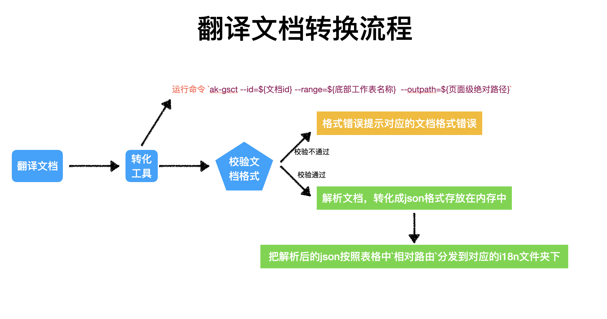
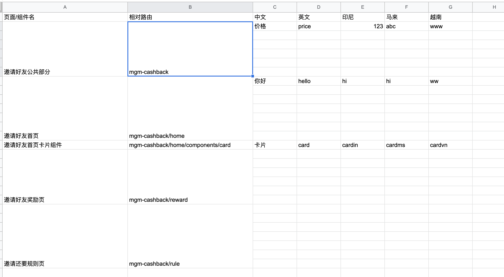
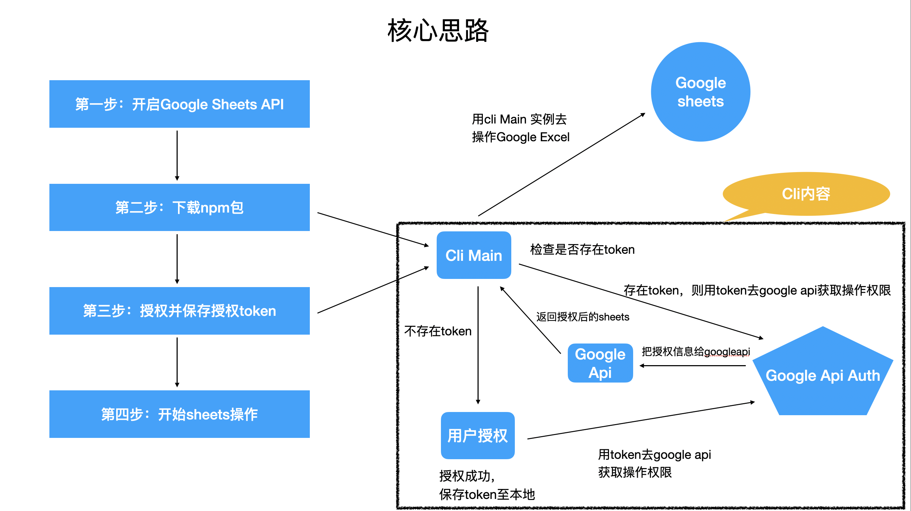

# 翻译文档转换工具

作用：将 google sheets 翻译文档转换到工程目录

流程：

- 定义 google sheets 翻译文档规范
- nodejs 工具 读取正确 sheets 格式 并导出到对应 i18n 文件夹内

流程图：

## google sheets 文档规范

文档格式翻译格式需要按照 `公共-页面-组件` 来进行编写翻译。

格式如下：

- `页面/组件名` 栏由产品编写、开发可以进行调整
- `相对路由` 由开发者进行编写
- `...` 后续为各类翻译

## nodejs 工具

nodejs 工具使用、处理步骤：

- 全局安转工具
- 运行命令： `ak-gsct --id=${文档id} --range=${底部工作表名称} --outpath=${页面级绝对路径}`
- 校验文档格式正确性
  - 错误时，打印错误提示
  - 正确时进行下一步
- 解析文档，转化成 json 格式存放在内存中
- 把解析后的 json 按照表格中`相对路由`分发到对应的 i18n 文件夹下

核心实现：

