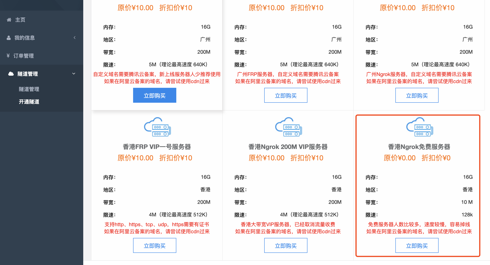
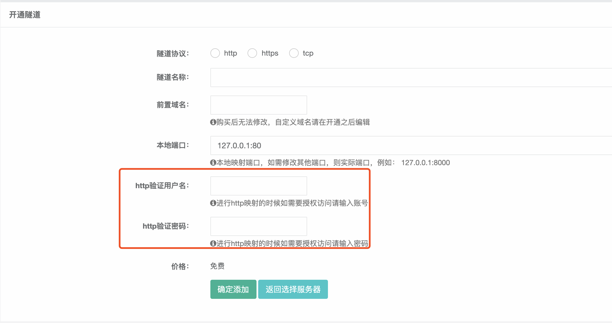

# 微信公众号开发

## 服务端接口开发

- 测试环境搭建
- 客服消息 - 消息接口(你问我答)
- 获取 `Access_token`
- 调用服务端接口
- `sha1` 算法
- 全局票据的管理

### [ngrok](https://www.ngrok.cc)

使用步骤：

- [去 ngrok 网站注册账号](https://www.ngrok.cc/login/register) 注册完登录

* 进入`隧道管理/开通隧道`页面



- 点击`立即购买`，会弹出确认框，点击确定会出现以下页面，有一个免费的可选择



注意：不需要填写 http 验证用户名和 http 验证密码，填写后每次访问页面都需要填写用户名和密码，后面设置公众平台测试账号接口配置信息时会失败

- 购买后再隧道管理页面就会出现一条隧道记录
- 点击[ngrok 下载](https://www.ngrok.cc/download.html) 使用文档点击去[官方查看](http://www.ngrok.cc/_book/start/ngrok_linux.html)

### 配置微信公众号测试地址

- 注册一个微信订阅号
- 进入`微信公众平台/开发/开发者工具`页面，点击`公众平台测试账号`，授权后就会进入测试号管理管理页面
- 进行设置`接口配置信息`

### [co-wechat](https://github.com/node-webot/co-wechat)

微信公众平台消息接口服务中间件

功能列表:

- 自动回复（文本、图片、语音、视频、音乐、图文）

github 地址：[co-wechat](https://github.com/node-webot/co-wechat)

使用：

```js
const wechat = require('co-wechat')
router.all(
  '/wechat',
  wechat(conf).middleware(async (message) => {
    console.log('wechat:', message)
    return 'Hello World ' + message.Content
  })
)
```

### [co-wechat-api](https://github.com/node-webot/co-wechat-api)

微信公共平台 API

功能列表:

- 发送客服消息（文本、图片、语音、视频、音乐、图文）
- 菜单操作（查询、创建、删除、个性化菜单）
- 二维码（创建临时、永久二维码，查看二维码 URL）
- [更多点击去 github 文档查看...](https://github.com/node-webot/co-wechat-api)

使用：

```js
const WechatAPI = require('co-wechat-api')
// 自动获取acess_token
const api = new WechatAPI(
  conf.appid,
  conf.appsecret,
  // 自定义取Token
  async () => await ServerToken.findOne(),
  // 自定义存Token
  async (token) => await ServerToken.updateOne({}, token, { upsert: true })
)
router.get('/getFollowers', async (ctx) => {
  let res = await api.getFollowers() // 获取用户userId
  // 获取用户详细信息
  res = await api.batchGetUsers(res.data.openid, 'zh_CN')
  ctx.body = res
})
```

## 网页端接口开发

- 网页授权接口
- `JSSDK`
- 全局票据的管理
- `OAuth2` 结合

### [co-wechat-oauth](https://github.com/node-webot/co-wechat-oauth)

Wechat OAuth for ES6。微信公共平台 OAuth 接口消息接口服务中间件与 API SDK

功能列表:

- OAuth 授权
- 获取基本信息

OAuth2.0 网页授权，使用此接口须通过微信认证，如果用户在微信中（Web 微信除外）访问公众号的第三方网页，公众号开发者可以通过此接口获取当前用户基本信息（包括昵称、性别、城市、国家）。详见：[api 文档](http://doxmate.cool/node-webot/co-wechat-oauth/api.html)
