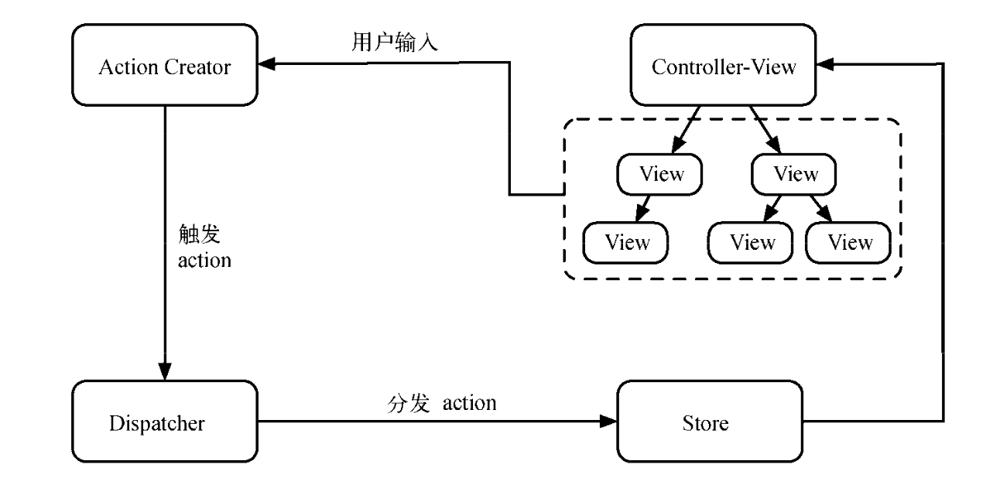

# Mobx 入门

本文主要介绍 Mobx 的一些常见用法和理念，以及一些使用注意事项，还会对比 Redux 和 Mobx 各自的优势，本篇文章不会过多的讲解 Redux 我 Mobx 的源码，在文章结尾处有几篇对 Redux 和 Mobx 源码的分析的文章，有感兴趣的同学可以去看一下

## 前言

如果你对为什么要使用 Redux 或者 Mobx 有疑惑的话，可以看一下下面这段解释：

当我们使用 React 开发 web 应用程序时，在 React 组件内，可以使用 this.setState()和 this.state 处理或访问组件内状态，但是随着项目变大，状态变复杂，通常需要考虑组件间通信问题，主要包括以下两点：

1. 某一个状态需要在多个组件间共享（访问，更新）；
2. 某组件内交互需要触发其他组件的状态更新；

关于这些问题，React 组件开发实践推荐将公用组件状态提升：

通常多组件需要处理同一状态，我们推荐将共享状态提升至他们的共同最近祖先组件内。

当项目越发复杂时，我们发现仅仅是提升状态已经无法适应如此复杂的状态管理了，程序状态变得比较难同步，操作，到处是回调，发布，订阅，这意味着我们需要更好的状态管理方式，于是就引入了状态管理库，如`Redux`，`Mobx`等。

## 状态管理

状态管理库，无论是 Redux，还是 Mobx 这些，其本质都是为了解决状态管理混乱，无法有效同步的问题，它们都支持：

1. 统一维护管理应用状态；
2. 某一状态只有一个可信数据来源，通常命名为 store，指状态容器；
3. 操作更新状态方式统一，并且可控，通常以 action 方式提供更新状态的途径；
4. 支持将 store 与 React 组件连接，如`react-redux`，`mobx-react`；通常使用状态管理库后，我们将 React 组件从业务上划分为两类：
   1. 容器组件（Container Components）：含有抽象数据而没有业务逻辑的组件；
   2. 展示型组件（Presentation Components）：负责展示视图，视图交互回调内调用传入的处理函数；

## Redux Vs Mobx

目前来看，Redux 已是 React 应用状态管理库中的霸主了，而 Mobx 则是一方诸侯，我们为什么要选择 Mobx，而不是继续沿用 Redux 呢，那就需要比较他们的异同了。
Mobx 和 Redux 都是 JavaScript 应用状态管理库，都适用于 React，Angular，VueJs 等框架或库，而不是局限于某一特定 UI 库。

## 先简单介绍一下 Redux

要介绍 Redux，我们就不得不谈到 Flux 了

Flux 是 Facebook 用来开发客户端-服务端 web 应用程序的应用架构，它更多是一种架构模式，而非一个特定框架。Flux 的核心思想就是：数据和逻辑永远单项流动。



而 Redux 更多的是遵循 Flux 模式的一种实现，是一个 JavaScript 库，它关注点主要是以下几方面：

- Action：一个 JavaScript 对象，描述动作相关信息，主要包含 type 属性和 payload 属性：
  - type：action 类型；
  - payload：负载数据；
- Reducer：定义应用状态如何响应不同动作（action），如何更新状态；
- Store：管理 action 和 reducer 及其关系的对象，主要提供以下功能：
  - 维护应用状态并支持访问状态（getState()）；
  - 支持监听 action 的分发，更新状态（dispatch(action)）；
  - 支持订阅 store 的变更（subscribe(listener)）；
- 异步流：由于 Redux 所有对 store 状态的变更，都应该通过 action 触发，异步任务（通常都是业务或获取数据任务）也不例外，而为了不将业务或数据相关的任务混入 React 组件中，就需要使用其他框架配合管理异步任务流程，如`redux-thunk`，`redux-saga`等；

## 接下来回到主题 -- Mobx

接下来我分为以下几部来讲解 Mobx：

- Mobx 是什么
- Mobx 核心概念
- 在 React 里使用 Mobx

### Mobx 是什么？

Mobx 是一个通过函数响应式编程，让状态管理更加简单和容易拓展的状态管理库，它遵循一个简单的原则：

Anything that can be derived from the application state, should be derived. Automatically.
任何可以从应用状态的获取的数据，都应该自动获取。

### Mobx 核心概念


核心原理：通过 action 触发 state 的变化，进而触发 state 的衍生(Derivations)对象(computed value & Reactions)。

可以看出，Mobx 的核心概念有以下几个：

- State(状态) 对应业务的状态
- Action(动作) 是任一一段可以改变状态的代码。用户事件、后端数据推送、预定事件、等等。在 MobX 中可以显式地定义动作，它可以帮你把代码组织的更清晰。 如果是在严格模式下使用 MobX 的话，MobX 会强制只有在动作之中才可以修改状态。
- Derivations(衍生) 源自状态并且不会再有任何进一步的相互作用的东西就是衍生。MobX 区分了两种类型的衍生:
  - Computed values(计算值) - 它们是永远可以使用纯函数(pure function)从当前可观察状态中衍生出的值。
  - Reactions(反应) - Reactions 是当状态改变时需要自动发生的副作用。需要有一个桥梁来连接命令式编程(imperative programming)和响应式编程(reactive programming)。或者说得更明确一些，它们最终都需要实现 I / O 操作。

#### State

在 Mobx 中，State 对应业务的状态，通过 observable，可以使这些状态变得可观察。

通常支持被 observable 的类型有三个，分别是 Object, Array, Map，对于原始类型可以使用 `Obserable.box`。

下面是针对 Object, Array, Map 的一个 🌰:

```js
import React, { Component } from 'react'
import { observable } from 'mobx'
import { observer } from 'mobx-react'

class AppState {
  @observable timer = 0
}

// 以上代码也可以写为，
// class AppState {
//   timer = 0
// }
// decorate(AppState, {
//   timer: observable,
// })

const appState = new AppState()

type IProps = {
  appState: {
    timer: number,
  },
}

@observer
class Demo1 extends Component<IProps> {
  componentDidMount() {
    setInterval(() => {
      // 注意了，这里直接改变了props的值，
      this.props.appState.timer = this.props.appState.timer + 1
    }, 2000)
  }
  render() {
    const { appState } = this.props
    return (
      <div>
        <h2>Demo1</h2>
        <div>{appState.timer}</div>
      </div>
    )
  }
}

export default <Demo1 appState={appState} />
```

这可以说是一段完整的代码，但这种写法会有一个弊端，更改 state 的地方会比较散乱，当项目越来越大时，你根本难以定位到修改 state 的地方，这时候就需要统一定制修改 state 方式。

#### Action

在讲 State 时，有一个很大的弊端，如果不进行限制 state 修改的方式，当项目越来越大时，状态的变更会很难预测，在 redux 中，唯一可以更改 state 的途径便是 dispatch 一个 action。这种约束性带来的一个好处是可维护性。整个 state 只要改变必定是通过 action 触发的，对此只要找到 reducer 中对应的 action 便能找到影响数据改变的原因。而 mobx 中，也提供了这样一种方式。

默认 Mobx 并不强制所有 state 的改变必须通过 action 来改变，这主要适用于一些较小的项目。对于较大型的，需要多人合作的项目来说，可以使用 Mobx 提供的 api configure 来强制，其中`enforceActions`就是用于设置改变状态的严格模式。
`enforceActions`有如下值：

- `never`(默认): 可以在任意地方修改状态
- `observed`: 在某处观察到的所有状态都需要通过动作进行更改。在正式应用中推荐此严格模式。
- `always`: 状态始终需要通过动作来更新(实际上还包括创建)

`enforceActions`原理：通过改变全局的 strictMode 以及 allowStateChanges 属性的方式来实现强制使用 action。

```js
import { observable, configure, action } from 'mobx'
// 设置后如果不通过action进行修改就会有报错提示
configure({
  enforceActions: 'observed',
})

class AppState {
  @observable timer = 0
  // 添加action
  @action changeTimer = () => {
    this.timer += 1
  }
}

const appState = new AppState()

type IProps = {
  appState: {
    timer: number
    changeTimer: Function
  }
}

@observer
class Demo2 extends Component<IProps> {
  componentDidMount() {
    setInterval(() => {
      this.props.appState.changeTimer()
    }, 2000)
  }
  render() {
    const { appState } = this.props
    return (
      <div>
        <h2>Demo2</h2>
        <div>{appState.timer}</div>
      </div>
    )
  }
}

export default <Demo2 appState={appState} />
```

设置只能通过 action 才能改变 action 时，那 Mobx 是如何进行异步处理呢？

和 Redux 不同的是，Mobx 在异步处理上并不复杂，不需要引入额外的类似 redux-thunk、redux-saga 这样的库。
唯一需要注意的是，在严格模式下，对于异步 action 里的回调，若该回调也要修改 observable 的值，那么该回调也需要绑定 action。

```js
import React, { Component } from 'react'
import { observable, configure, action, runInAction } from 'mobx'
import { observer } from 'mobx-react'
import { Button } from 'antd'

configure({
  enforceActions: 'observed',
})
class AppState {
  @observable timer = 0
  @action changeTimer = (num?: number) => {
    this.timer += num || 1
  }
  @action asyncChangeTimer = (num?: number) => {
    setTimeout(() => {
      // 直接改变也会报错，必须再次调用一个action方法来改变
      // this.timer += num || 2 // 会报错
      // 需要调用同步的action方法进行改变state，这里有三种方式
      // 1. 调用已有action
      // this.changeTimer(num)
      // 2. 可以直接用action包裹
      // action('actionAsyncChangeTimer', () => {
      //   this.timer += num || 2
      // })
      // 3. 如果不想到处写action，可以使用Mobx提供的工具函数runInAction来简化操作。runInAction其实
      runInAction(() => {
        this.timer += num || 2
      })
      // 注意，runInAction 还可以给定第一个参数作为名称。runInAction(f) 实际上是 action(f)() 的语法糖。
    }, 1000)
  }
}

const appState = new AppState()

type IProps = {
  appState: {
    timer: number
    changeTimer: Function
    asyncChangeTimer: Function
  }
}

@observer
class Demo2 extends Component<IProps> {
  render() {
    const { appState } = this.props
    return (
      <div>
        <h2>Demo2</h2>
        <div>{appState.timer}</div>
        <Button
          onClick={() => {
            this.props.appState.changeTimer()
          }}
        >
          add
        </Button>
        <Button
          onClick={() => {
            this.props.appState.asyncChangeTimer(2)
          }}
        >
          async add
        </Button>
      </div>
    )
  }
}

export default <Demo2 appState={appState} />
```

上面仅仅介绍了调用一个新的或者类似一个新的 action 进行异步处理，实际上可以直接用 async/await 方式进行处理

```js
@action asyncChangeTimer = async (num?: number) => {
  const addNum = await new Promise<number>(resolve => {
    setTimeout(() => {
      resolve(num)
    }, 1000)
  })
  this.changeTimer(addNum)
}
```

action 的官方文档可以看这里：[https://cn.mobx.js.org/refguide/action.html](https://cn.mobx.js.org/refguide/action.html)
action 异步处理：[https://cn.mobx.js.org/best/actions.html](https://cn.mobx.js.org/best/actions.html)

#### computed

Mobx 中 state 的设计原则和 redux 有一点是相同的，那就是尽可能保证 state 足够小，足够原子。这样设计的原则不言而喻，无论是维护性还是性能。那么对于依赖 state 的数据而衍生出的数据，可以使用 computed。

简而言之，你有一个值，该值的结果依赖于 state，并且该值也需要被 obserable，那么就使用 computed。

通常应该尽可能的使用计算属性，并且由于其函数式的特点，可以最大化优化性能。如果计算属性依赖的 state 没改变，或者该计算值没有被其他计算值或响应（reaction）使用，computed 便不会运行。在这种情况下，computed 处于暂停状态，此时若该计算属性不再被 observable。那么其便会被 Mobx 垃圾回收。

```ts
import { observable, autorun, computed } from 'mobx'
import { observer } from 'mobx-react'
import { Checkbox, Button } from 'antd'

type todo = {
  id: number
  title: string
  checked: boolean
}

type TypeTodos = Array<todo>

class AppState {
  @observable todos: TypeTodos = [
    { id: Math.random(), title: 'haha', checked: false },
  ]
  @computed get toDoLength() {
    return this.todos.length
  }
}

const appState = new AppState()

autorun(() => {
  console.log('todos.length', appState.todos.length)
})

autorun(() => {
  console.log('toDoLength', appState.toDoLength)
})
appState.todos.push({ id: Math.random(), title: 'haha-1', checked: false })
appState.todos[1] = {
  id: Math.random(),
  title: 'haha-1-replace',
  checked: false,
}

// 输出如下：
// 'todos.length' 2
// 'toDoLength' 2
// 'todos.length' 2
```

最后一行其实只是改了数组中的一个值，但是也触发了 autorun 的执行。从上面可以看出，此时如果用 computed 便会解决该问题。

#### autorun

另一个响应 state 的 api 便是 autorun。和 computed 类似，每当依赖的值改变时，其都会改变。不同的是，autorun 没有了 computed 的优化（当然，依赖值未改变的情况下也不会重新运行，但不会被自动回收）。因此在使用场景来说，autorun 通常用来执行一些有副作用的。例如打印日志，更新 UI 等等。

#### reaction

Derivations 主要有两种类型组成：`computed` 和 `Reactions`。

`Reactions`还有一个 api 就叫做`reaction`，上面的`autorun`是通过 `reaction` 实现的。

```js
import { observable, autorun, reaction } from 'mobx'

const todos = observable([
  {
    title: 'todo1',
    done: true,
  },
  {
    title: 'todo2',
    done: false,
  },
])

// reaction 的错误用法: 对 length 的变化作出反应, 而不是 title 的变化!
const reaction1 = reaction(
  () => todos.length,
  length => console.log('reaction 1:', todos.map(todo => todo.title).join(', '))
)

// reaction 的正确用法: 对 length 和 title 的变化作出反应
const reaction2 = reaction(
  () => todos.map(todo => todo.title),
  titles => console.log('reaction 2:', titles.join(', '))
)

// autorun 对它函数中使用的任何东西作出反应
const autorun1 = autorun(() =>
  console.log('autorun 1:', todos.map(todo => todo.title).join(', '))
)
console.log(autorun1, reaction1, reaction2)

todos.push({ title: 'todo3', done: false })
// 输出:
// reaction 1: todo1, todo2, todo3
// reaction 2: todo1, todo2, todo3
// autorun 1: todo1, todo2, todo3

todos[0].title = 'todo1 haha'
// 输出:
// reaction 2: todo1 haha, todo2, todo3
// autorun 1: todo1 haha, todo2, todo3
```

在上面示例中，reaction1、reaction2 和 autorun1 都会对 todos 数组中的 todo 的添加、删除或替换作出反应。 但只有 reaction2 和 autorun 会对某个 todo 的 title 变化作出反应，因为在 reaction2 的数据表达式中使用了 title，而 reaction1 的数据表达式没有使用。 autorun 追踪完整的副作用，因此它将始终正确触发，但也更容易意外地访问相关数据

粗略地讲，reaction 是 computed(expression).observe(action(sideEffect)) 或 autorun(() => action(sideEffect)(expression)) 的语法糖。

### Mobx 原理分析

## Redux 和 Mobx 的对比

介绍完 Redux 和 Mobx，下面我们进行一下对比

### 函数式和面向对象

Redux 更多的是遵循函数式编程（Functional Programming, FP）思想，而 Mobx 则更多从面相对象角度考虑问题。
Redux 提倡编写函数式代码，如 reducer 就是一个纯函数（pure function），如下：

```js
(state, action) => {
  return Object.assign({}, state, {
    ...
  })
}
```

纯函数，接受输入，然后输出结果，除此之外不会有任何影响，也包括不会影响接收的参数；对于相同的输入总是输出相同的结果。

Mobx 设计更多偏向于面向对象编程（OOP）和响应式编程（Reactive Programming），通常将状态包装成可观察对象，于是我们就可以使用可观察对象的所有能力，一旦状态对象变更，就能自动获得更新。

### 单一 store 和多 store

store 是应用管理数据的地方，在 Redux 应用中，我们总是将所有共享的应用数据集中在一个大的 store 中，而 Mobx 则通常按模块将应用状态划分，在多个独立的 store 中管理。

### JavaScript 对象和可观察对象

Redux 默认以 JavaScript 原生对象形式存储数据，而 Mobx 使用可观察对象：

Redux 需要手动追踪所有状态对象的变更；
Mobx 中可以监听可观察对象，当其变更时将自动触发监听；

### 不可变（Immutable）和可变（Mutable）

Redux 状态对象通常是不可变的（Immutable）：

```js
switch (action.type) {
  case REQUEST_POST:
  	return Object.assign({}, state, {
      post: action.payload.post
  	});
  default:
    retur nstate;
}
```

我们不能直接操作状态对象，而总是在原来状态对象基础上返回一个新的状态对象，这样就能很方便的返回应用上一状态；而 Mobx 中可以直接使用新值更新状态对象。

### mobx-react 和 react-redux

使用 Redux 和 React 应用连接时，需要使用 react-redux 提供的 Provider 和 connect：

1. Provider：负责将 Store 注入 React 应用；
2. connect：负责将 store state 注入容器组件，并选择特定状态作为容器组件 props 传递；

对于 Mobx 而言，同样需要两个步骤：

1. Provider：使用 mobx-react 提供的 Provider 将所有 stores 注入应用；
2. 使用 inject 将特定 store 注入某组件，store 可以传递状态或 action；然后使用 observer 保证组件能响应 store 中的可观察对象（observable）变更，即 store 更新，组件视图响应式更新。

## 结语

如果对 redux 或者 Mobx 的原理感兴趣，可以看一下以下文章：

- [完全理解 redux（从零实现一个 redux）](https://mp.weixin.qq.com/s/idWmfUbPVVqK7Yi0_9NC4A)
- [用故事解读 Mobx 源码](https://segmentfault.com/a/1190000013682735) 我自己都还没来得及看 😂

最后分享一个开源库，我自己写的 redux 解决方案库，还没写多久，不够完善，大家看了欢迎给我提提建议：[https://github.com/ht1131589588/demacia](https://github.com/ht1131589588/demacia)

## 参考

- [Mobx 中文文档](http://cn.redux.js.org/)
- [你需要 Mobx 还是 Redux](https://juejin.im/post/5a7fd72c5188257a766324ae)
- [MobX 简介](https://tate-young.github.io/2019/03/20/react-mobx.html#reactions-%E5%8F%8D%E5%BA%94)
- [Mobx —— React 状态管理另一条路](https://juejin.im/post/5a3e611a6fb9a0451239279d)
