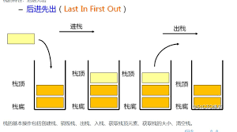

# 数据结构之---栈

栈是一个特殊的线性表，仅能够在栈顶进行操作，有着先进后出(后进先出)的特性，下面这张图展示了栈的工作特点：



## 栈的实现

从数据存储的角度看，实现栈有两种方式，一种是以 `数组` 为基础，一种是以 `链表` 为基础。

栈有哪些方法呢（以羽毛球桶为例）？

- `push` 添加一个元素到栈顶（向桶里放入一个羽毛球）
- `pop` 弹出栈顶元素（从桶里拿出一个羽毛球）
- `top` 返回栈顶元素，不弹出（看一眼桶里最顶端的羽毛球，但不拿）
- `isEmpty` 判断栈是否为空（看看桶里还有没有羽毛球）
- `size` 返回栈里元素的个数（数一下桶里还有多少个羽毛球）
- `clear` 清空栈（把桶里的羽毛球都倒出来）

### 用数组的方式实现栈

```js
function Stack() {
  var items = []
  // 添加元素
  this.push = (item) => {
    items.push(item)
  }
  // 弹出栈顶元素
  this.pop = () => {
    return items.pop()
  }
  // 查看栈顶元素
  this.top = () => {
    return items[item.length - 1]
  }
  // 获取栈的大小
  this.size = () => {
    return items.length
  }
  // 判断栈是否为空
  this.isEmpty = () => {
    return items.length === 0
  }
  // 清空栈
  this.clear = () => {
    item.length = 0
  }
}
```

## 栈的运用

### 题一：合法括号

判断字符串中括号是否成对出现

#### 思路分析

- 用 `for` 循环遍历字符串每个字符
- 遇到左括号，就把左括号压入栈中
- 遇到右括号，判断栈是否为空，为空说明没有左括号与之对应，缺少左括号，字符串括号不合法；如果栈不为空，则把栈顶元素弹出，这对括号抵消了
- 当 `for` 循环结束时，如果栈是空的，就说明所有的左右括号都抵消了，如果栈不为空，说明缺少右括号，字符串不合法

#### 代码实现

```js
function isLegalBracket(str) {
  let stack = new Stack()
  for (let i = 0; i < str.length; i++) {
    if (str[i] === '(') {
      stack.push(str[i])
    }
    if (str[i] === ')') {
      if (stack.isEmpty()) {
        return false
      }
      stack.pop()
    }
  }
  if (!stack.isEmpty()) {
    return false
  }
  return true
}
```

### 题二：计算逆波兰表达式

逆波兰表达式，也叫做后缀表达式，它将复杂表达式转换为可以依靠简单的操作得到计算结果的表达式。

示例：

```bash
["4", "13", "5", "/", "+"] 等价于 (4 + (13 / 5)) = 6

["10", "6", "9", "3", "+", "-11", "*", "/", "*", "17", "+", "5", "+"] 等价于 ((10 * (6 / ((9 + 3) * -11))) + 17) + 5
```

#### 思路分析

- 循环数组
- 如果元素不是 `+ - * /` 中的某一个，就压入栈中
- 如果元素是 `+ - * /` 中的某一个，就从栈中连续弹出两个元素，并对两个元素进行计算，将结果压出栈中
- f 循环结束后，栈中只有一个元素，这个元素就是整个表达式的计算结果

#### 代码实现

```js
function calcExp(array) {
  var stack = new Stack()
  let res
  var operators = {
    '+': '+',
    '-': '-',
    '*': '*',
    '/': '/'
  }
  for (let i = 0; i < array.length; i++) {
    if (!operators[array[i]]) {
      // 如果元素不是 `+ - * /` 中的某一个，就压入栈中
      stack.push(array[i])
    } else {
      // 如果元素是 `+ - * /` 中的某一个
      let element2 = stack.pop()
      let element1 = stack.pop()
      if (element1 && element2) {
        res = evel(element1 + array[i] + element2)
        stack.push(res)
      } else {
        return 'err'
      }
    }
  }
  return res
}
```
