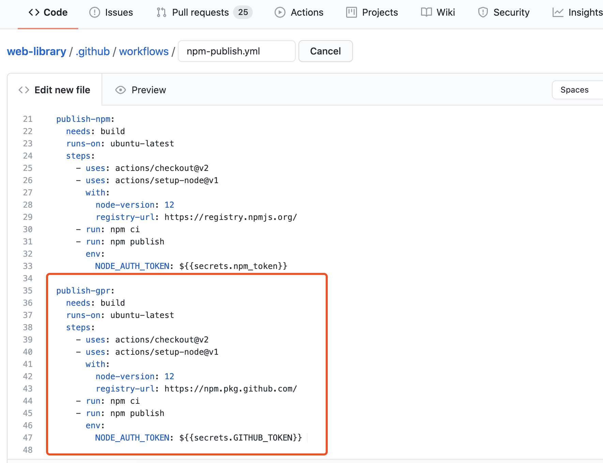
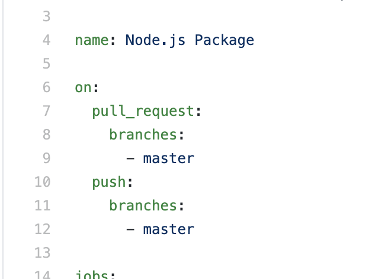
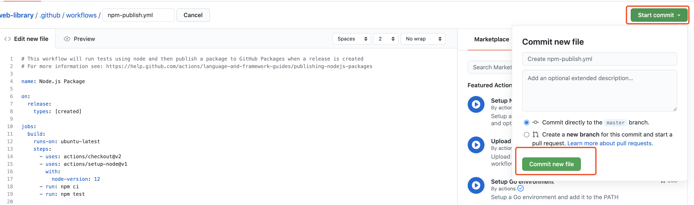
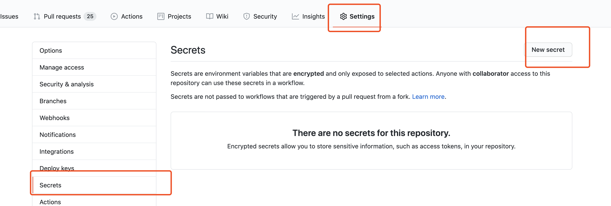

# Github 中的 CI/CD

主要分享和记录使用 `Github` 中的 `CI/CD` 功能的过程：

- npm 包自动化发布

## npm 包自动化发布

具体实现步骤：

- 创建 `workflow` 模板，并修改 npm-publish 配置文件
- 配置 `.npmignore` 文件
- 获取 `npm token`
- 配置 `secrets`
- 一些注意事项

### 创建 workflow 模板，并修改 npm-publish 配置文件

先进入创建 `workflow` 模板页面


这时会让你编辑配置文件 `npm-publish.ymal`

删除 `publish-gpr`配置



修改`on`事件监听部分



然后提交



### 配置 `.npmignore` 文件

```
node_modules
.github
```

### 获取 `npm token`


创建成功后单击就可以复制 token（token 在页面关闭后将不再出现）

### 配置 `secrets`

打开 github 项目页面选择 Settings -> Secrets -> add a new secret




### 注意事项

- `package.json` 与 `package-lock.json` 版本号必须一致
- 必须要有 `package-lock.json`

### 查看构建过程


### 参考文章

- [Github 持续化集成 工作流 Npm 包自动化发布](https://www.cnblogs.com/gaobw/p/11593602.html)
