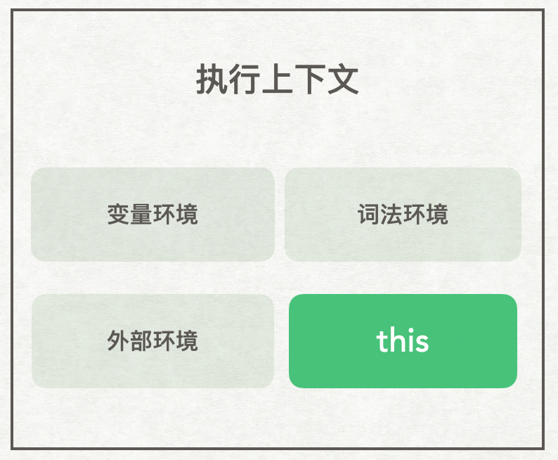

# 理解JavaScript中的this

    注：重读《浏览器工作原理与实践》过程中记录笔记以及记录自己的思考。

在说 `this` 之前我们先看两段代码：

```js
// JS
var bar = {
    myName:"我是bar",
    printName: function () {
        console.log(myName)
    }    
}
let myName = "外部名称"
bar.printName() // 外部名称
```

在JS中会打印出 `"外部名称"`

```c++
// C++
#include <iostream>
using namespace std;
class Bar{
    public:
    char* myName;
    Bar(){
      myName = "我是bar";
    }
    void printName(){
       cout<< myName <<endl;
    }  
} bar;

char* myName = "外部名称";
int main() {
  bar.printName(); // 我是bar
  return 0;
}
```

在 C++ 代码中，我们同样调用了 bar 对象中的 printName 方法，最后打印出来的却是 `"我是bar"`，因此`在对象内部的方法中使用内部属性是一个非常普遍的需求`。但 JavaScript 因为其 `作用域机制`，而并无法支持这样的`需求`，所以引入了其独特的`this机制`。

下面使用this，就能完成`在对象内部的方法中使用内部属性`的这个需求了。

```js
var bar = {
    myName:"我是bar",
    printName: function () {
        console.log(this.myName)
    }    
}
let myName = "外部名称"
bar.printName() // 我是bar
```

## `JavaScript` 中的 this 是什么？

在JavaScript的执行上下文中，包含了 `变量环境`、`词法环境`、`外部环境` 以及 `this`，具体如下



也就是说， `this` 是和执行上下文绑定的，每个执行上下文中都有一个 `this`。执行上下文主要分为 `全局执行上下文` 、 `函数执行上下文` 和 `evel执行上下文`。下面进行分析三种执行上下文中的this

### 全局执行上下文中的 this

### 函数执行上下文中的 this

### evel执行上下文中的 this

## `this` 的坑点以及应对方案

## 总结