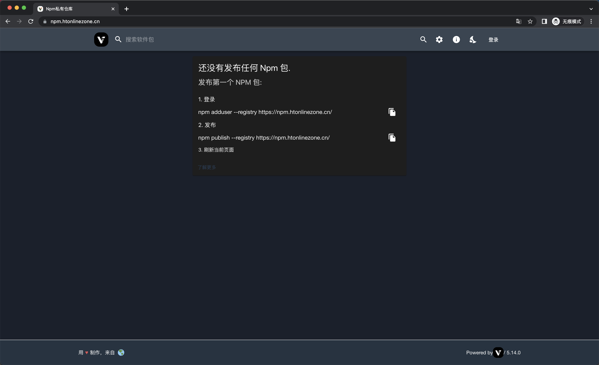

# 搭建 npm 私有仓库

文章内容来源：[从 0 到 1 落地前端工程化 ———— 私有仓库](https://juejin.cn/book/7034689774719860739/section/7036006800998531072)

> 技术要点：Verdaccio

### 前言

有些不能开源的代码或对第三方开源代码做定制化修改与扩展的代码，这些模块需在内部管理与共享，不能上传到`Npm公有仓库`，因此需搭建`Npm私有仓库`满足上述需求。这些模块的所有权属于公司，多少都包括一些商业机密的业务逻辑，那这些模块绝对不能发布到公网，不然会引来无谓的法律纠纷。

本章将带领你**部署一个属于自己的Npm私有仓库**，将自己或公司的模块代码部署到该仓库并通过一系列操作使整个`私有仓库`具备`Npm服务`的功能。

### 背景：俄乌战争的影响

对于`Npm私有仓库`，应是所有前端团队必会经历的一个开发与部署环节。很多业务发展到一定规模，就会进入`模块化`与`组件化`的重构阶段，重构代码块所组成的模块需由一个运行在内网的数据平台托管并提供类似`Npm`服务的功能。

拥有自己或公司的`Npm私有仓库`，能让这些模块代码得到更好的保护或管理，在安全行与完整性中有更好的保障。毕竟托管在公网，万一哪天发生像俄乌战争的情况，美国政府实行单边政治策略封锁，导致很多托管在`Github`或`Npm`的代码无法使用，那就真的只能说四字真言了。

搭建自己或公司的`Npm私有仓库`，同时还能提升`Npm模块`的安装速度与镜像稳定性。例如淘宝镜像`cnpm`，其本质也是一个特大型的`Npm私有仓库`。公司内部搭建`Npm私有仓库`就可为自己的员工提供更快速稳的代码共享下载平台。

### 方案：部署一个属于自己的Npm私有仓库

实现`Npm私有仓库`的方式有很多种，例如`Gitlib私有仓库`、`cnpm`、`sinopia`和`verdaccio`。`Gitlib私有仓库`与`cnpm`配置很繁琐，不适合快速开发，`sinopia`已7年多未维护。那剩下只能选择`verdaccio`了。

`verdaccio`的前身是`sinopia`，因为`sinopia`的作者突然宣布不维护，一些开发大神就收起该烂摊子，基于`sinopia@1.4.0`开发了`verdaccio`并一直维护至今。

`verdaccio`提供一套完整的生产工具链，它的界面与`Npm`相近，具备可换主题皮肤，可控多国语言，内置小型数据库，集合`Npm服务`等功能，确实是搭建`Npm私有仓库`的首选。因为功能强大，它具备其他工具无法媲美的优点。

- 可控制`Npm私有仓库`的访问权限
- 可利用内置缓存功能提升安装依赖的速度
- 可发布私有模块，不被权限配置外部的开发者使用
- 可通过代理安装`Npm公有仓库`不存在或安装很慢的模块
- 可搭配`Docker`与`Kubernetes`使用

稍微扒下源码，发现`verdaccio`其实就是一个大炖锅，前端基于`react`开发，后端基于`express`开发。内置的小型数据库基于封装的`@verdaccio/local-storage`实现本地文件的读写操作，因此不是一个正真意义的数据库。内置的主题界面基于封装的`@verdaccio/ui-theme`实现本地主题的自由切换，通过修改源码深层次定制主题界面后，当`verdaccio`发布最新版本，更新或不更新都是难题，因此定制主题很麻烦，还不如使用官方提供的主题。

##### 安装

因为`verdaccio`只能运行在`Node v12`以上的环境，在安装前先检查当前`Node版本`并将其切换到`v12`以上。第10章安装了几个`Node版本`，那就使用最新的`Node版本`。

```bash
# 检查当前Node版本
node -v
# 将Node版本切换到v16
nvm use 16.17.0
```

打开`CMD工具`，执行`npm i -g verdaccio`，再执行`verdaccio -v`，输出版本表示安装成功。

##### 启动

直接执行`verdaccio`，输出以下信息。该信息包括`verdaccio`的配置文件、启用插件、服务地址等信息。在默认情况下，`verdaccio`启动的服务监听`4873`端口，点击`http://localhost:4873`会打开一个清爽的界面。

```bash
warn --- config file  - /home/user/.config/verdaccio/config.yaml
warn --- Plugin successfully loaded: verdaccio-htpasswd
warn --- Plugin successfully loaded: verdaccio-audit
warn --- http address - http://localhost:4873/ - verdaccio/5.9.0
```

整个界面简洁美观，印象中是早期`Npm官网`的设计风格，包括搜索、语言、帮助、皮肤、登录和列表等模块。首次创建的`verdaccio`应用无任何模块数据，因此首页会提示登录账号并发布模块。


##### 配置

虽然通过一行简单命令就能启动一个`Npm私有仓库`，但其默认配置并不符合生产需求，因此接着会重新修改配置并熟悉相关配置文档。

打开`CMD工具`，登录服务器。使用上述方式安装`verdaccio`，安装完毕执行`verdaccio -h`，发现只有两个参数可修改默认配置。

- [x] **--listen**：简写为`-l`，监听端口，默认是`4873`
- [x] **--config**：简写为`-c`，配置文件，不同系统路径会不一样

可根据当前需求将`监听端口`与`配置文件`重置。配置文件使用`YAML`语法编写，可查看[YAML教程](https://www.runoob.com/w3cnote/yaml-intro.html)。

配置|功能|描述|选项
:-:|:-:|-|-
**storage**|模块路径|`npm publish`发布的模块存放在此
**plugins**|插件路径|~
**i18n**|国际语言|~|[选项](https://github.com/verdaccio/verdaccio/blob/master/packages/plugins/ui-theme/src/i18n/enabledLanguages.ts#L13)
**web**|用户界面|~|[选项](https://verdaccio.org/zh-CN/docs/webui#configuration)
**auth**|用户验证|默认使用`htpasswd`，提供`登录注册`、`用户鉴权`等功能|[选项](https://verdaccio.org/zh-CN/docs/authentication#default-htpasswd)
**uplinks**|上行链路|安装依赖时找不到相关模块会根据该配置向上查找|[选项](https://verdaccio.org/zh-CN/docs/uplinks#configuration)
**packages**|控制权限|提供`模块配置`、`模块授权`等功能|[选项](https://verdaccio.org/zh-CN/docs/packages#configuration)
**notify**|消息通知|提供自定义通知功能，需通讯软件暴露相关通知接口|[选项](https://verdaccio.org/zh-CN/docs/notifications#configuration)
**server**|服务器配置|~
**middlewares**|中间件配置|默认使用`auit`，支持`npm audit`命令
**logs**|终端信息|~
**experiments**|实验特性|提供`search`搜索模块功能

打开`shell工具`，创建`tool/verdaccio`文件夹，在`/tool/verdaccio`目录中创建`config.yaml`文件，执行`vim /tool/verdaccio/config.yaml`，加入以下内容。

```yaml
# url_prefix: /npm/
storage: ./storage
plugins: ./plugins
i18n:
  web: zh-CN
web:
  title: Npm私有仓库
  darkMode: true
auth:
  htpasswd:
    file: ./htpasswd
uplinks:
  npmjs:
      url: https://registry.npmmirror.com/
packages:
  "**":
    proxy: npmjs
    access: $all
    publish: $authenticated
    unpublish: $authenticated
  "@*/*":
    proxy: npmjs
    access: $all
    publish: $authenticated
    unpublish: $authenticated
server:
  keepAliveTimeout: 100
middlewares:
  audit:
    enabled: true
logs: { type: stdout, format: pretty, level: http }
```

> 控制权限

搭建`Npm私有仓库`的目的是让托管模块仅对团队成员开放，该仓库只服务具备权限的团队成员且禁止团队外的开发者注册，当然可让其他开发者查看，因此团队成员拥有`查看模块`、`发布模块`和`删除模块`的权限，团队外的开发者拥有`查看模块`的权限。

`packages`中使用`**`表示`普通模块`，使用`@*/*`表示`范围模块`，提供以下参数设置模块的控制权限。

- [x] **proxy**：上行链路的代理仓库
- [x] **access**：访问权限
- [x] **publish**：发布权限
- [x] **unpublish**：删除权限

`proxy`会映射`uplinks`，安装依赖时，在该仓库找不到的模块会代理到`uplinks`指定的仓库中查找，拉取成功后会以压缩包格式缓存到`storage`文件夹中。

剩余三个参数可选`$all/$anonymous/$authenticated`，分别表示`所有用户`、`匿名用户`和`注册用户`。若该仓库不对外公布所有私有模块，可将这三个参数全部设置为`$authenticated`。

> 消息通知

发布模块就会立即通知整个团队成员，相信该功能是一个很好的开发体验。`verdaccio`本身具备一个简单的通知功能，需搭配`Webhooks`使用，可传递简单的载荷到可接收的通讯软件。目前只对`npm publish`有效。

比如使用`泡泡`这款内部软件实现工作通讯，查看相关文档可知其`Webhooks`为`https://popo.netease.com/notify/send?token=xyz`(因为保密所以乱写一个不存在的`URL`)。

执行`vim /tool/verdaccio/config.yaml`，加入以下内容。

```yaml
notify:
  endpoint: https://popo.netease.com/notify/send?token=xyz
  method: POST
  headers: [{ "Content-Type": "application/json" }]
  content: '{ "color": "green", "message": "{{publisher.name}} 发布 {{name}} 成功！", "message_format": "text", "notify": true }'
```

其中`publisher.name`表示发布者，`name`表示包名及其版本。当一个模块发布到`Npm私有仓库`时，团队成员的`泡泡`就会收到以下信息。

```txt
JowayYoung 发布 @yangzw/bruce-app v1.1.0 成功！
```

其实`notify`还可设置多个通讯软件同时接收信息。例如`钉钉`的`Webhooks`为`https://oapi.dingtalk.com/robot/send?access_token=xyz`，将上述配置改成以下配置。

```yaml
notify:
  "popo":
    endpoint: https://popo.netease.com/notify/send?token=xyz
    method: POST
    headers: [{ "Content-Type": "application/json;charset=utf-8" }]
    content: '{ "color": "green", "message": "{{publisher.name}} 发布 {{name}} 成功！", "message_format": "text", "notify": true }'
  "dingtalk":
    endpoint: https://oapi.dingtalk.com/robot/send?access_token=xyz
    method: POST
    headers: [{ "Content-Type": "application/json;charset=utf-8" }]
    content: '{ "color": "green", "message": "{{publisher.name}} 发布 {{name}} 成功！", "message_format": "text", "notify": true }'
```

---

完善所有配置后，将`监听端口`改成`8888`，将配置文件改成`/tool/verdaccio/config.yaml`，执行以下命令启动应用。

```bash
verdaccio -l 8888 -c /tool/verdaccio/config.yaml
```

为了使进程常驻，按下`ctrl+c`停用上述命令，改用`pm2`执行上述命令。

```bash
pm2 start verdaccio --name npm --watch -- -l 8888 -c /tool/verdaccio/config.yaml
```

##### 部署

在服务器中配置一个全新的`npm.xxx.cn`二级域名，该域名用于托管`verdaccio应用`。

在`/etc/nginx/conf.d`目录中创建`npm.xxx.cn.conf`文件，执行`vim /etc/nginx/conf.d/npm.xxx.cn.conf`，加入以下内容。

```conf
server {
	server_name npm.xxx.cn;
	location / {
		proxy_pass http://127.0.0.1:8888;
		proxy_set_header Host $host;
		proxy_set_header X-Forwarded-For $remote_addr;
		proxy_set_header X-Forwarded-Proto https;
	}
}
```

执行`certbot --nginx`，选择二级域名`npm.xxx.cn`，输出以下信息表示配置成功。

```bash
Successfully received certificate.
Certificate is saved at: /etc/letsencrypt/live/npm.xxx.cn/fullchain.pem
Key is saved at:         /etc/letsencrypt/live/npm.xxx.cn/privkey.pem
This certificate expires on 2022-09-03.
These files will be updated when the certificate renews.
Certbot has set up a scheduled task to automatically renew this certificate in the background.

Deploying certificate
Successfully deployed certificate for npm.xxx.cn to /etc/nginx/conf.d/npm.xxx.cn.conf
Congratulations! You have successfully enabled HTTPS on https://npm.xxx.cn
```

每次新开端口都需在服务器中配置安全组。这次增加`8888`端口，那在安全组中配置一个`8888`端口。

最后执行`nginx -t`验证`Nginx`配置，再执行`nginx -s reload`重启`Nginx`进程。在浏览器地址栏中输入[https://npm.xxx.cn](https://npm.xxx.cn)就可正常访问自己的`Npm私有仓库`了。



### 使用：操作与Npm完全一样

搭建的`Npm私有仓库`的镜像为`https://npm.xxx.cn`，若后续需安装私有模块，那每次执行命令都需加上`--registry https://npm.xxx.cn/`，真是麻烦。

可用`nrm`管理该仓库镜像。执行`nrm add ynpm https://npm.xxx.cn/`新增镜像，`ynpm`是自己定义的镜像名称。执行`nrm ls`，输出以下信息表示`ynpm`已增加到镜像列表中。

```bash
npm ---------- https://registry.npmjs.org/
yarn --------- https://registry.yarnpkg.com/
tencent ------ https://mirrors.cloud.tencent.com/npm/
cnpm --------- https://r.cnpmjs.org/
taobao ------- https://registry.npmmirror.com/
npmMirror ---- https://skimdb.npmjs.com/registry/
ynpm --------- https://npm.xxx.cn/
```

以后使用`Npm私有仓库`就执行`nrm use ynpm`切换到该仓库，不使用记得还原镜像。切换为`ynpm`后，执行`npm i`先从`Npm私有仓库`查找所需的私有模块，再从上行链路的代理仓库中查找公有模块。

以下全部操作基于`Npm私有仓库`，前提条件是执行`nrm use ynpm`。

##### 注册用户

执行以下命令注册用户，会要求输入账号、密码和邮箱。这些信息被用于以后登录`Npm私有仓库`，所以记得保存好。

```bash
npm adduser
```

若将`Npm私有仓库`部署到外网，其他开发者除了能查看模块，还能通过执行`npm adduser --registry https://npm.xxx.cn/`注册用户。为了保障`Npm私有仓库`的安全性与私密性，最好在部署到外网前将所有团队成员注册为`Npm私有仓库`用户，再配置`config.yaml`限制新用户注册。

执行`vim /tool/verdaccio/config.yaml`，更新`auth`配置，将`max_users`设置为`-1`禁止用户注册。

```yaml
auth:
  htpasswd:
    file: ./htpasswd
  max_users: -1
```

##### 登录用户

执行以下命令登录用户，根据要求输入`账号`、`密码`和`邮箱`。

```bash
npm login
```

##### 删除用户

不可避免团队成员的人员变动，因此删除这些离职或转岗的成员的控制权限是必然的。目前`verdaccio`暂未提供相关解决方案，可通过一个小技巧解决该问题。

上述提到`verdaccio`使用`htpasswd`实现用户验证相关功能，而`auth-htpasswd-file`指定的配置文件是`./htpasswd`，那对应文件路径是`/tool/verdaccio/htpasswd`。

执行`vim /tool/verdaccio/htpasswd`，找到那人的账号，整行删除，接着就无那人啥事了。

```txt
yangjiamin:v3pJKo/Tmrmm.:autocreated 2021-06-29T09:03:25.480Z
```

这些记录每行对应一个用户，若把记录删除，该用户就不能登录了。

##### 发布模块

第18章开发的`多包仓库`中的每个模块都可发布到`Npm私有仓库`。进入每个模块根目录，执行以下命令发布模块。

```bash
npm publish
```

因为`Npm私有仓库`不会像`Npm公有仓库`那样对包名做诸多限制，所以可将那些被`Npm公有仓库`占用的包名用到私有模块中。接着将自己开发的模块都发布到`Npm私有仓库`，使其看上去更饱满，哈哈！

##### 删除模块

执行以下命令删除模块。在`Npm私有仓库`删除模块相比在`Npm公有仓库`删除模块更方便，不会有诸多限制。

```bash
npm unpublish <pkg>
```

若私有模块发布超过`24小时`，执行上述命令是无法将其删除的，需加上`--force`。

```bash
npm unpublish <pkg> --force
```

##### 安装模块

对于一个刚拉取下来的项目执行`npm i`，就会自动识别哪些模块是私有模块。有时并不是所有场景都需提前执行`nrm use ynpm`，单独安装一个私有模块时指定其`Npm私有仓库`的镜像即可。

```bash
npm i <pkg> --registry https://npm.xxx.cn/
```

### 总结

`verdaccio`初衷是提供一套更快更好地部署`Npm私有仓库`的解决方案，其轻量级的定位很适合个人或团队使用。通过阅读源码可知，`verdaccio`提供很多功能类的定制化而缺乏界面类的定制化，若对UI有要求，那只能参照`verdaccio`源码自行开发一套新UI了。

另外有些团队已使用`cnpm`搭建`Npm私有仓库`，若将其迁移到`verdaccio`中确实会存在很多麻烦，毕竟`cnpm`依赖`MySQL`数据库，而`verdaccio`依赖自己封装的`“文本数据库”`，光从数据迁移这部分来说就是一个很大的麻烦。若非要迁移，也只能从以下解决方案中选择了。

- 抛弃以往版本，通过手动方式在`verdaccio`中重新将所有私有模块的最新版本发布一次
- 分析`verdaccio`的数据库内容，通过脚本方式将原来版本数据转换为`verdaccio`认识的数据

最后还是很推荐使用`verdaccio`，毕竟它的轻量级特性不只是说说，一直用一直爽！
