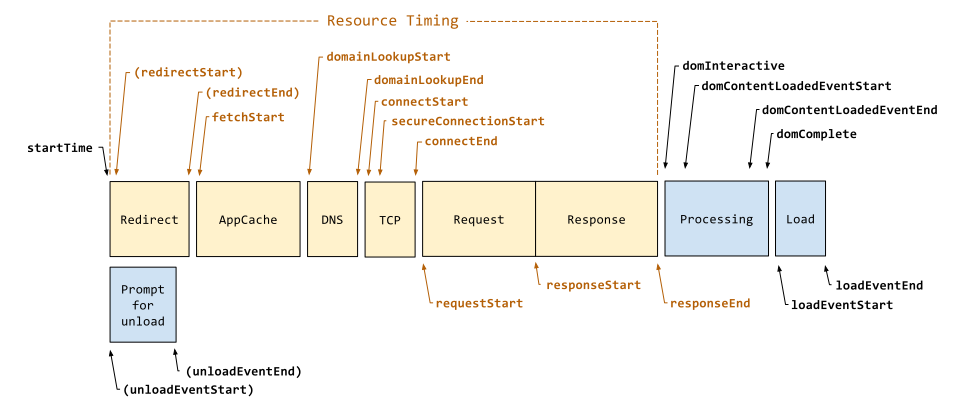

# 前端性能优化

## 前言

首先我们先问一个问题，为什么需要性能优化呢？

- 访问页面的速度太慢，很长时间才有响应，用户等了几秒发现还没有内容，就会直接退出页面
- 用户进入页面后，操作卡断，用户会觉得网站相应慢或者没有响应，会影响用户继续使用下去的欲望
- 页面播放的动画效果卡顿，会影响用户的感官，用户会觉得页面不流畅

从上面几个问题中，我们可以分析出影响性能的主要两个因素：

- 加载性能：页面首屏内容显示耗时会影响用户是否会中途退出的重要因素
- 运行时性能：内容加载完成后，操作卡顿或者动画不流畅，是影响用户是否愿意继续使用该页面的重要因素


下面我们从转化率和跳出率来看一些网站的真实数据统计，可以很直观的理解性能对于一个网站的影响（此部分摘自原文[为什么网站速度很重要？](https://www.cloudflare.com/zh-cn/learning/performance/why-site-speed-matters)）：

转化率：多项研究表明，网站速度会影响转化率（即用户完成目标操作的比率）。与速度较慢的网站相比，不仅更多用户停留在快速加载的网站上，而且他们的转化率也更高。许多公司发现页面加载时间减少几毫秒都会增加转化率：

- Mobify发现将其首页的加载时间减少100毫秒会导致基于会话的转换次数增加1.11％
- 将页面加载时间缩短一半后，零售商AutoAnything的销售额增长了12-13％
- 沃尔玛发现，将页面加载时间缩短一秒，可以将转换率提高2％


跳出率：跳出率是用户在只浏览一个页面后就离开网站的百分比。如果页面在几秒钟内未加载，用户就可能关闭窗口或单击离开网站。英国广播公司（BBC）发现，网页加载每增加一秒钟，他们就会失去总用户的10％。


从上面的数据可以看出页面性能的重要性。接下来我们从`性能指标`来分析性能优化方案。

## 性能指标

性能指标可以分为三大类：`文档加载`、`内容呈现`、`交互响应`。

主要会介绍指标的定义以及测量方法。其中加载类指标主要关注 `LCP`，运行时类指标主要关注`FID`。

### 文档加载相关指标



#### Time to First Byte（TTFB）

浏览器从请求页面开始到接收第一字节的时间，这个时间段内包括 `DNS` 查找、 `TCP` 连接和 `SSL` 连接。 `TTFB` 不仅是页面的加载，每个接口或者其他资源请求都有自己的 `TTFB` 时间。

测量方法：

```js
new PerformanceObserver((entryList) => {
  const [pageNav] = entryList.getEntriesByType('navigation');
  console.log(`TTFB: ${pageNav.responseStart}`);
}).observe({
  type: 'navigation',
  buffered: true
});
```

指标具体描述可以参考：https://web.dev/ttfb/


#### DomContentLoaded（DCL）

`DomContentLoaded` 事件触发的时间。当 `HTML` 文档被完全加载和解析完成之后,`DOMContentLoaded` 事件被触发，而无需等待样式表、图像和子框架加载完成。为了让Html按正常样式显示完整，一般会把样式表放在头部进行加载，阻塞 `HTML` 文档的解析。


#### Load

window.onLoad 事件触发的时间。页面所有资源都加载完毕后（比如图片，CSS），onLoad 事件才被触发。


### 内容呈现相关指标

像 `Load` 或 `DOMContentLoaded` 这样的度量并不能反映用户的视觉体验，因为它们的时间点不一定与用户在屏幕上看到内容的时间点对应。

我们需要一些可以能够体现页面内容呈现速度的指标。

#### `First Paint`(FP): 

`FP` 定义是渲染树首次转变为屏幕像素的过程，我们用FP time来表达首次渲染时间。在FP之前我们看见的屏幕是空白的，那么FP time也可理解为白屏时间。计算方法：

```js
if (window.performance) {
    let pf = window.performance;
    let pfEntries = pf.getEntriesByType('paint')
    let fp = pfEntries.find(each => each.name === 'first-paint')
    console.log('first paint time: ', fp && fp.startTime)
}
```

#### `First Contentful Paint`(FCP): 首次内容绘制

`FCP` 从页面加载到屏幕上首次有渲染内容的过程，这里的内容可以是文本、图像、svg元素和非白色canvas元素。计算方法：

```js
if (window.performance) {
    let pf = window.performance;
    let pfEntries = pf.getEntriesByType('paint')
    let fp = pfEntries.find(each => each.name === 'first-contentful-paint')
    console.log('first contentful paint time: ', fp && fp.startTime)
}
```

`FCP` 是测量感知加载速度的一个以用户为中心的重要指标，因为该项指标会在用户首次在屏幕上看到任何内容时，在页面加载时间轴中标记出相应的点，迅捷的 FCP 有助于让用户确信某些事情正在进行。

实际上不管是ssr还是csr， `FCP` 和 `FP` 在测试结果看来没有任何区别。

指标具体描述可以参考：https://web.dev/fcp/

#### `Largest Contentful Paint`(LCP) 最大内容绘制

`LCP`从页面加载到屏幕上首次有渲染内容的过程，这里的内容可以是文本、图像、svg元素和非白色canvas元素。计算方法：

```js
new PerformanceObserver((entryList) => {
  for (const entry of entryList.getEntries()) {
    console.log('LCP candidate:', entry.startTime, entry);
  }
}).observe({type: 'largest-contentful-paint', buffered: true});
```

`LCP` 是测量感知加载速度的一个以用户为中心的重要指标，因为该项指标会在页面的主要内容基本加载完成时，在页面加载时间轴中标记出相应的点，迅捷的 LCP 有助于让用户确信页面是有效的。

指标具体描述可以参考：https://web.dev/lcp/


#### `Speed Index`(SI) 速度指数

`Speed Index` 衡量页面加载期间内容的视觉显示速度。Lighthouse 首先捕获浏览器中页面加载的视频，并计算帧之间的视觉进展。

指标具体描述可以参考：https://web.dev/speed-index/


### 交互响应相关指标

#### `Time to Interactive`(TTI) 可交互时间

`TTI` 指标测量页面从开始加载到主要子资源完成渲染，并能够快速、可靠地响应用户输入所需的时间。

`TTI` 是测量加载响应度的重要实验室指标。该指标有助于识别看起来具备交互性但实际上并非如此的页面情况。迅捷的 `TTI` 有助于确保页面的有效性。

但 `TTI` 是一种非标准化的 Web 性能“进度”指标，定义为最后一个长任务完成且之后网络和主线程处于非活动状态 5 秒的时间点。因此使用工具测量出来的时间和实际上可交互时间并不一致。

指标具体描述可以参考：https://web.dev/tti/

#### `First Input Delay`(FID) 首次输入延迟

`FID` 是测量加载响应度的一个以用户为中心的重要指标，因为该项指标将用户尝试与无响应页面进行交互时的体验进行了量化，低 FID 有助于让用户确信页面是有效的。

指标具体描述可以参考：https://web.dev/fid/

#### `Frames Per Second`(FPS) 帧率

`FPS` 是设备产生图像（或帧）的速率，用每秒可以重新绘制的帧数（Frames Per Second，FPS）表示。

重新绘制可能需要重新计算样式、布局和绘制，如果每帧绘制到屏幕的时间在 16.7 ms 以上，每秒绘制的帧数就会小于 60 帧，人眼就能感受到页面出现卡顿，所以 FPS 是衡量应用流畅度的一个非常重要的指标，60fps 是页面流畅的目标，可以为每次绘制提供 16.7ms 的时间预算。

### 核心指标

一般页面主要关注的核心指标有以下几点：

- FP

从`ssr`（服务端渲染）、`csr`（客户端渲染）两个方向来看页面需要的核心指标。

`ssr` 的渲染流程：
- 白屏：访问页面 => server动态生成html字符串 => 浏览器获取 `关键资源` => DOMContentLoaded
- 渲染显示 html 中文本内容：需要
- 加载并显示图片、视频等需要请求网络的资源：有部分资源有可能在浏览器获取关键资源的情况下已经加载完毕
- 加载其他页面需要的资源（js、css）：有部分资源有可能在浏览器获取关键资源的情况下已经加载完毕

`csr` 的渲染流程：
- 白屏：访问页面 => 静态 `html` 文件 => 浏览器获取所有同步css、js资源 => js获取接口内容，第一次更新页面内容完成的前一刻（浏览器渲染流水线结束前）。
- 显示 html 中文本内容：
- 页面加载并显示图片、视频等需要请求网络的资源：

从上面可以看出 `ssr` 的优势在于页面首屏内容在服务端就已经生成并直接返回给了浏览器，服务端因为接口是内网以及服务器的处理速度更快，因此速度远远大于浏览器加载完成所有资源后再请求接口显示页面的内容的速度。

因此 `ssr` 和 `csr` 需要关注的核心指标也会有一些差异性：

- `ssr`中主要关注`FP`和`TTI`，因为 `FP`时已经显示了最大的内容 `FP` 和 `FCP` 完全一致，


#### ssr中的核心指标

`ssr` 的过程是 server 直出页面内容，再加载js资源，所以页面的显示过程是：白屏 => 页面文本内容 => 图片内容。
`csr` 的过程是 server 返回

`LCP` ：最大内容绘制，测量加载性能。为了提供良好的用户体验，LCP 应在页面首次开始加载后的2.5 秒内发生。

`FID`: 首次输入延迟，测量交互性。为了提供良好的用户体验，页面的 FID 应为100 毫秒或更短。


## 性能优化方案

性能优化主要从几方面来：
- 代码体积
  - js
  - css
- 优化图片大小
- 懒加载
- 缓存

## 参考


