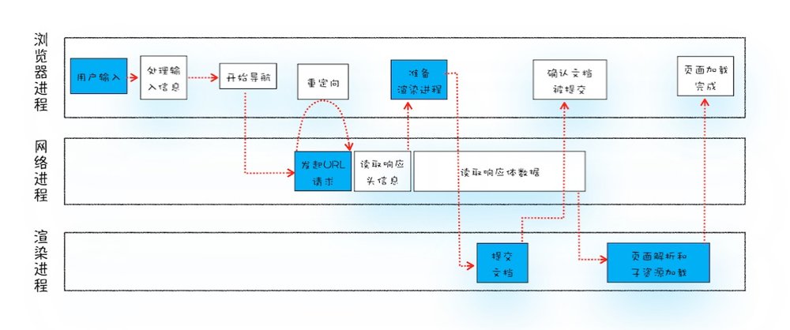

# Web前端性能优化实践

## 前言

首先我们先问一个问题，为什么需要性能优化呢？

- 访问页面的速度太慢，很长时间才有响应，用户等了几秒发现还没有内容，就会直接退出页面
- 用户进入页面后，操作卡断，用户会觉得网站相应慢或者没有响应，会影响用户继续使用下去的欲望
- 页面播放的动画效果卡顿，会影响用户的感官，用户会觉得页面不流畅

从上面几个问题中，我们可以分析出影响性能的主要两个因素：

- 加载性能：页面首屏内容显示耗时会影响用户是否会中途退出的重要因素
- 运行时性能：内容加载完成后，操作卡顿或者动画不流畅，是影响用户是否愿意继续使用该页面的重要因素


下面我们从转化率和跳出率来看一些网站的真实数据统计，可以很直观的理解性能对于一个网站的影响（此部分摘自原文[为什么网站速度很重要？](https://www.cloudflare.com/zh-cn/learning/performance/why-site-speed-matters)）：

转化率：多项研究表明，网站速度会影响转化率（即用户完成目标操作的比率）。与速度较慢的网站相比，不仅更多用户停留在快速加载的网站上，而且他们的转化率也更高。许多公司发现页面加载时间减少几毫秒都会增加转化率：

- Mobify发现将其首页的加载时间减少100毫秒会导致基于会话的转换次数增加1.11％
- 将页面加载时间缩短一半后，零售商AutoAnything的销售额增长了12-13％
- 沃尔玛发现，将页面加载时间缩短一秒，可以将转换率提高2％


跳出率：跳出率是用户在只浏览一个页面后就离开网站的百分比。如果页面在几秒钟内未加载，用户就可能关闭窗口或单击离开网站。英国广播公司（BBC）发现，网页加载每增加一秒钟，他们就会失去总用户的10％。


从上面的数据可以看出页面性能的重要性。


## 从输入url到页面完全加载

为了更好的理解影响性能的因素，我们需要理清楚这样一个问题：`在浏览器里，从输入url到页面加载完成，这中间发生了什么？`



上面这张图展示了处理 url 到页面加载完成的整个过程，图片来源于极客时间 [浏览器工作原理与实践](https://time.geekbang.org/column/article/117637)

从上图我们再来梳理具体的过程：

1. 用户输入 `url`
2. 浏览器进程将该 `url` 转发给 网络进程
3. 网络进程接收到请求后，先检查本地缓存是否可用，缓存可用则直接读取缓存并返回给浏览器进程；缓存不可用再发起真正的 `url` 请求。 `url` 请求过程如下：
   1. `DNS` 解析，获取服务器 `ip地址和端口`
   2. 与服务端建立 `http` 连接
   3. 构建和发送请求头信息
   4. 服务端处理请求后响应请求
   5. 浏览器网络进程接收并解析响应内容
4. 浏览器进行分配渲染进程，开始渲染流程。
5. 渲染进程解析 `html`：解析过程中如果 `header` 中使用非异步方式引入 `css` 或者 `js` 资源，就会先加载资源，再进行 `DOM` 的解析
6. 执行渲染流水线：此时关键资源已经加载完毕，进行浏览器的渲染流水线：
   1. 构建 `DOM` 树
   2. 样式计算（Recalculate Style）：把 `CSS文本` 转换为浏览器可以识别的结构--styleSheets => 属性标准化 => 计算出 `DOM` 树中每个节点的具体样式
   3. 布局（Layout）：创建 `布局树` ，并计算元素布局信息
   4. 分层（Layers）：对布局树进行分层，生成分层树。（在更多工具里面可以打开 Layers 面板）
   5. 生成图层绘制列表，提交到合成线程。
   6. 合成线程将图层分成图块，并在光栅化线程池中将图块转换成位图。
   7. 合成线程发送绘制图块命令 `DrawQuad` 给浏览器进程。
   8. 浏览器进程根据 `DrawQuad` 消息生成页面，并显示到显示器上。
7. 首屏渲染结束
   1. 如果是 `ssr`， 白屏结束，显示页面首屏内容。
   2. 如果是 `csr`，则等待 body底部所有js加载完毕后，js执行生成页面。
8. 所有资源下载完毕


了解了页面显示的整个过程，我们就可以更好的分析影响页面性能的因素。

## 性能指标

性能指标可以分为三大类：`文档加载`、`内容呈现`、`交互响应`。

主要会介绍指标的定义以及测量方法。其中加载类指标主要关注 `LCP`，运行时类指标主要关注`FID`。

### 文档加载相关指标


#### Time to First Byte（TTFB）

浏览器从请求页面开始到接收第一字节的时间，这个时间段内包括 `DNS` 查找、 `TCP` 连接和 `SSL` 连接。 `TTFB` 不仅是页面的加载，每个接口或者其他资源请求都有自己的 `TTFB` 时间。

测量方法：

```js
new PerformanceObserver((entryList) => {
  const [pageNav] = entryList.getEntriesByType('navigation');
  console.log(`TTFB: ${pageNav.responseStart}`);
}).observe({
  type: 'navigation',
  buffered: true
});
```

指标具体描述可以参考：https://web.dev/ttfb/


#### DomContentLoaded（DCL）

`DomContentLoaded` 事件触发的时间。当 `HTML` 文档被完全加载和解析完成之后,`DOMContentLoaded` 事件被触发，而无需等待样式表、图像和子框架加载完成。为了让Html按正常样式显示完整，一般会把样式表放在头部进行加载，阻塞 `HTML` 文档的解析。


#### Load

window.onLoad 事件触发的时间。页面所有资源都加载完毕后（比如图片，CSS），onLoad 事件才被触发。


### 内容呈现相关指标

像 `Load` 或 `DOMContentLoaded` 这样的度量并不能反映用户的视觉体验，因为它们的时间点不一定与用户在屏幕上看到内容的时间点对应。

我们需要一些可以能够体现页面内容呈现速度的指标。

#### `First Paint`(FP): 

`FP` 定义是渲染树首次转变为屏幕像素的过程，我们用FP time来表达首次渲染时间。在FP之前我们看见的屏幕是空白的，那么FP time也可理解为白屏时间。计算方法：

```js
if (window.performance) {
    let pf = window.performance;
    let pfEntries = pf.getEntriesByType('paint')
    let fp = pfEntries.find(each => each.name === 'first-paint')
    console.log('first paint time: ', fp && fp.startTime)
}
```

#### `First Contentful Paint`(FCP): 首次内容绘制

`FCP` 从页面加载到屏幕上首次有渲染内容的过程，这里的内容可以是文本、图像、svg元素和非白色canvas元素。计算方法：

```js
if (window.performance) {
    let pf = window.performance;
    let pfEntries = pf.getEntriesByType('paint')
    let fp = pfEntries.find(each => each.name === 'first-contentful-paint')
    console.log('first contentful paint time: ', fp && fp.startTime)
}
```

`FCP` 是测量感知加载速度的一个以用户为中心的重要指标，因为该项指标会在用户首次在屏幕上看到任何内容时，在页面加载时间轴中标记出相应的点，迅捷的 FCP 有助于让用户确信某些事情正在进行。

实际上不管是ssr还是csr， `FCP` 和 `FP` 在测试结果看来没有任何区别。

指标具体描述可以参考：https://web.dev/fcp/

#### `Largest Contentful Paint`(LCP) 最大内容绘制

`LCP`从页面加载到屏幕上首次有渲染内容的过程，这里的内容可以是文本、图像、svg元素和非白色canvas元素。计算方法：

```js
new PerformanceObserver((entryList) => {
  for (const entry of entryList.getEntries()) {
    console.log('LCP candidate:', entry.startTime, entry);
  }
}).observe({type: 'largest-contentful-paint', buffered: true});
```

`LCP` 是测量感知加载速度的一个以用户为中心的重要指标，因为该项指标会在页面的主要内容基本加载完成时，在页面加载时间轴中标记出相应的点，迅捷的 LCP 有助于让用户确信页面是有效的。

指标具体描述可以参考：https://web.dev/lcp/


#### `Speed Index`(SI) 速度指数

`Speed Index` 衡量页面加载期间内容的视觉显示速度。Lighthouse 首先捕获浏览器中页面加载的视频，并计算帧之间的视觉进展。

指标具体描述可以参考：https://web.dev/speed-index/


### 交互响应相关指标

#### `Time to Interactive`(TTI) 可交互时间

`TTI` 指标测量页面从开始加载到主要子资源完成渲染，并能够快速、可靠地响应用户输入所需的时间。

`TTI` 是测量加载响应度的重要实验室指标。该指标有助于识别看起来具备交互性但实际上并非如此的页面情况。迅捷的 `TTI` 有助于确保页面的有效性。

但 `TTI` 是一种非标准化的 Web 性能“进度”指标，定义为最后一个长任务完成且之后网络和主线程处于非活动状态 5 秒的时间点。因此使用工具测量出来的时间和实际上可交互时间并不一致。

指标具体描述可以参考：https://web.dev/tti/

#### `First Input Delay`(FID) 首次输入延迟

`FID` 是测量加载响应度的一个以用户为中心的重要指标，因为该项指标将用户尝试与无响应页面进行交互时的体验进行了量化，低 FID 有助于让用户确信页面是有效的。

指标具体描述可以参考：https://web.dev/fid/

#### `Frames Per Second`(FPS) 帧率

`FPS` 是设备产生图像（或帧）的速率，用每秒可以重新绘制的帧数（Frames Per Second，FPS）表示。

重新绘制可能需要重新计算样式、布局和绘制，如果每帧绘制到屏幕的时间在 16.7 ms 以上，每秒绘制的帧数就会小于 60 帧，人眼就能感受到页面出现卡顿，所以 FPS 是衡量应用流畅度的一个非常重要的指标，60fps 是页面流畅的目标，可以为每次绘制提供 16.7ms 的时间预算。

## 性能监控方案


## 性能优化方案

了解完 `从输入url到页面完全加载` 的过程后，我们再整理和分析了提现页面性能的指标。接下来我们就可以根据其他几个方面和性能指标分类来分析性能优化方案。

### 加载或内容呈现性能优化

加载性能主要影响因素有： `资源响应速度` 、`资源体积优化` 、 `资源加载的顺序` 、 `代码质量` 、 `用户网络速度` 、 `用户设备条件` ，不过用户网速和设备我们无法控制，所以我们主要优化方向是其他几个方面

#### 资源响应速度

资源影响的速度的优化主要在于服务端和http协议上，主要优化手段有：

- 升级http协议，使用 http2 或者 http3 ，不过 http3 的普及率还较差，升级 http2 也会让网络传输变快很多，http2带来的的优势可以看这一篇文章：[解读 HTTP1/HTTP2/HTTP3](https://juejin.cn/post/6995109407545622542)
- 静态资源使用CDN：内容分发网络（CDN）是一组分布在多个不同地理位置的 Web 服务器。我们都知道，当服务器离用户越远时，延迟越高。CDN 就是为了解决这一问题，在多个位置部署服务器，让用户离服务器更近，从而缩短请求时间。CDN的优势可以去看[CDN 原理](https://juejin.cn/post/6892994632968306702#heading-12)
- 利用浏览器缓存资源：webpack缓存方案（https://www.webpackjs.com/guides/caching）

#### 资源体积优化

不同资源类型优化方式不一样。

##### 文本资源

文本资源包含 `HTML` 、 `CSS` 、 `JS` 等，主要优化手段：

- 代码压缩：minify
- 压缩内容：比如使用 gzip 压缩
- 代码精简
- `JS` 体积优化方案
   - Tree Shaking
   - Code Split
   - 组件按需加载
   - 代码按需打包
- `CSS` 体积优化方案
   - 引入第三方库样式文件时按需引入
   - 减少不必要的 css 前缀补全

##### 图片资源

一个页面，图片资源的大小一般占据整个页面资源体积的一半以上，因此图片资源体积优化也非常重要。

图片体积优化的手段：

- 去掉不必要的图片，能使用样式实现的不要使用图片
- 雪碧图（http2及以上不需要雪碧图）
- 上传图片大小限制
- 压缩项目静态图片
- 接入Webp图片处理，可以根据浏览器请求中所带的 `accept` 来判断是否支持webp格式，各cdn厂商基本上也都支持webp图片转换：[阿里云图像处理](https://help.aliyun.com/document_detail/209551.htm?spm=a2c4g.11186623.0.0.48e473c362lahb#section-ivw-6eg-iuz)

#### 资源加载的顺序

在 `从输入url到页面完全加载` 中我们讲解了页面呈现的过程，因此可以知道资源加载是有顺序的，因此我们需要梳理清楚哪些是关键资源，哪些是非关键资源。

资源加载顺序往往于代码所在位置有关：

1. 一般我们需要把关键资源比如 `css` 放在 `header` 中，以便于页面渲染出来时，页面能按照预期中的样式正常显示。
2. `js` 代码一般放在 `DOM` 底部，如果 `JavaScript` 文件中没有操作 `DOM` 相关代码，就可以将该 `JavaScript` 脚本设置为异步加载，通过 `async` 或 `defer` 来标记代码； `async` 和 `defer` 虽然都是异步的，不过还有一些差异，使用 `async` 标志的脚本文件一旦加载完成，会立即执行；而使用了 `defer` 标记的脚本文件，需要在 `DOMContentLoaded` 事件之前执行。

#### 代码质量

代码质量分为很多方面，比如代码量、复杂度、代码结构设计等等

##### 代码量

代码量优化的方案主要分为一下几种：

- 代码精简：使用简洁并清晰的代码编写，这个一般与开发者的工作经验或者知识面有很大的关系
  - 使用 `lodash` 提供的功能函数
  - 使用正则替代一些复杂的js校验或者匹配功能
  - 合理使用一些位运算符
  - 使用es6语法
  - 去除无效代码
- 抽离并封装公用模块代码
  - 当一个功能被多次使用就应该封装成公共函数
  - 公共组件封装
- css原子化，尽量让每一行css都能得到充分利用

##### 代码复杂度设计

复杂度主要分为 `时间复杂度` 和 `空间复杂度`。

`时间复杂度` 对性能的影响在于：增加 js 解析时间，主要主要优化手段有以下几种：

- 减少嵌套循环，使用空间换时间
- 使用高性能算法处理复杂功能


`空间复杂度` 对性能的影响在于：占据设备内存过大时，可能引起浏览器崩溃等问题，主要主要优化手段：

- 减少全局变量，和注意全局变量所占内存，防止内存不断增大，导致内存溢出。
- 注意销毁不需要的对象，防止不销毁旧的对象，又不断生成新的对象，页面所在内存持续增长，导致页面崩溃。

##### 代码结构设计

好的代码结构设计，对性能的提升影响会特别大，主要的一些设计手段有以下几种：

1. 组件懒加载：让页面首次加载只渲染首屏展示的内容，可以提升首屏生产内容的速度和DOM解析显示到页面的速度，当DOM节点过多，对于浏览器的渲染进程的压力也会越大，显示到页面的时间就会长
2. `virtual-list` : 当长列表页面上拉加载越来越多的内容时，DOM节点会不断增大，就会造成每次生产新图层会越来越久，就会出现渲染卡顿、内存增大等问题，因此可以使用`virtual-list`方案只给DOM添加当前屏幕显示的DOM节点，可以避免出现渲染卡顿等问题。
3. `图片懒加载`：当页面图片太多，同时请求会对服务端造成一定的压力，也可以防止并发加载的资源过多而阻塞js 或者其他关键资源的加载。
4. css 对性能的优化方案：可参考[仅使用CSS提高页面渲染速度](https://juejin.cn/post/6942661408181977118


### 交互相关性能优化

影响交互性能的主要有几方面： `操作响应速度`、 `动画流畅度`、 `页面流畅度`、 `交互体验设计`。

#### 操作响应速度

什么情况会影响操作的响应速度？

- 操作后执行时间过长，用户等待时间长
- 有任务正在执行，占据主线程，需要等待主线程空闲

这里我们不谈代码细节的优化，我们可以从以下几个方面进行优化操作响应的速度：

- 首次加载只执行首屏需要的代码，非首屏需要的代码可以按需加载
- React 可以开启 Concurrent 模式来实现可中断渲染，优先处理用户操作：[Concurrent 模式介绍](https://zh-hans.reactjs.org/docs/concurrent-mode-intro.html)
- 利用

#### 动画流畅度

#### 页面流畅度

#### 交互体验设计


## 优化实践
## 参考资源


