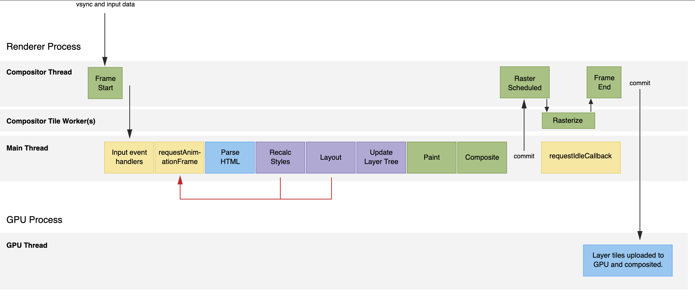

# React 源码解读

在源码探索的过程中，我们会遇到一些没有遇到过的一些概率或者 api，在具体分析源码之前，先看一下以下常用的概率和一些 api 的使用技巧，先列一个目录：

- 屏幕刷屏率
- 帧
  - requestAnimationFrame
  - requestIdleCallback
  - MessageChannel
- 单链表

## 屏幕刷屏率

- 目前大部分浏览器的屏幕刷屏率为 60 次/秒
- 浏览器渲染动画或者页面的每一帧的速度也需要跟屏幕刷屏率保持一致
- 页面是一帧一帧绘制出来的，当每秒绘制的帧数（FPS）达到屏幕刷屏率时，页面是流畅的，小于这个值时，用户会感觉到卡顿，这里可以这样理解：比如当动画连续性小于 60 次/秒，动画就会出现"迟钝"，当动画连续性大于 60 次/秒时，因为屏幕刷屏率只有 60 次/秒，页面也不会更加流畅，反而会因为操作太频繁而对性能有所影响
- 1s 60 帧，所以每一帧分到的时间是 `1000/60 ≈ 16ms`。所以我们书写代码时要避免让一帧的工作量操过 16ms
- 当然，不同的设备的屏幕刷屏率是不同的，现在很多手机的屏幕刷屏率都超过 120 次/秒，每一帧分到的时间也就只有 8ms 多一点

## 帧

在上面的`屏幕刷屏率`中已经提到了帧，这里继续深入探索一帧的时间内，浏览器做了什么

- 每个帧的开头包括样式计算、布局和绘制
- JS 执行引擎和页面渲染引擎在同一个渲染线程。GUI 渲染和 JS 执行是互斥的
- 如果每个任务时间过长，浏览器会推迟渲染

